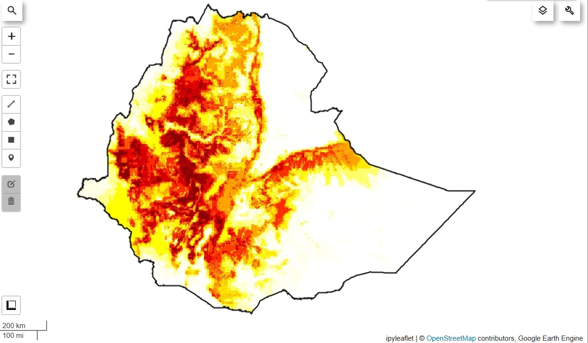
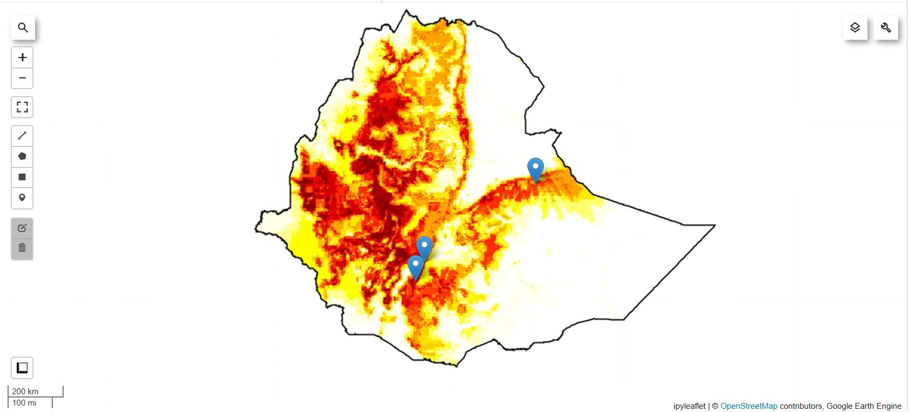
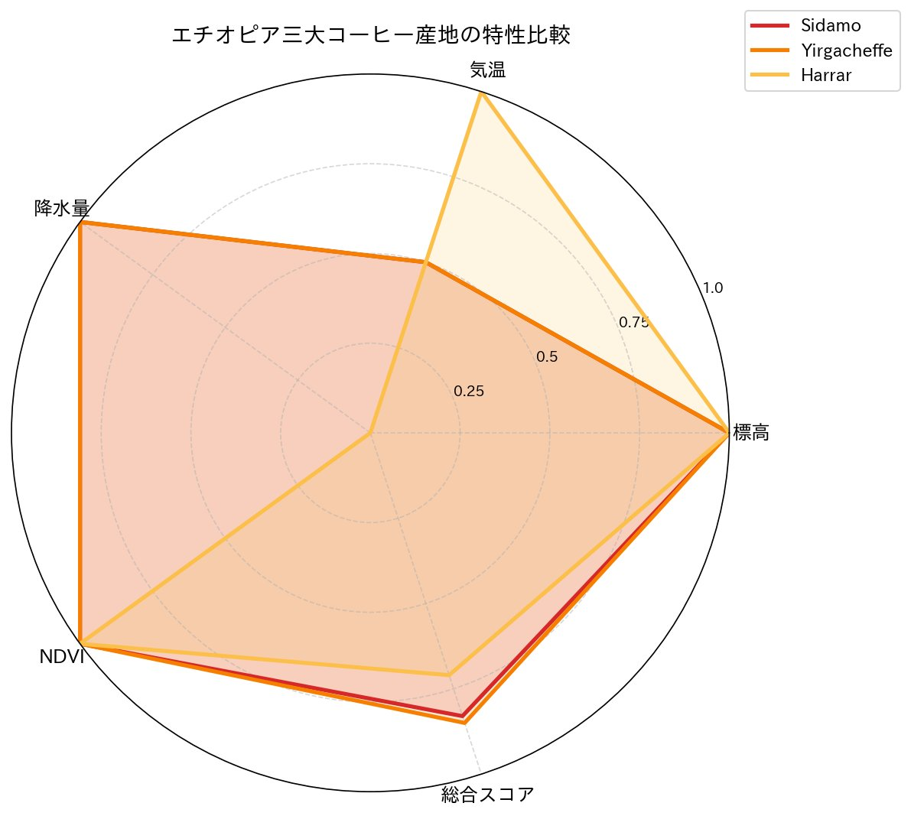
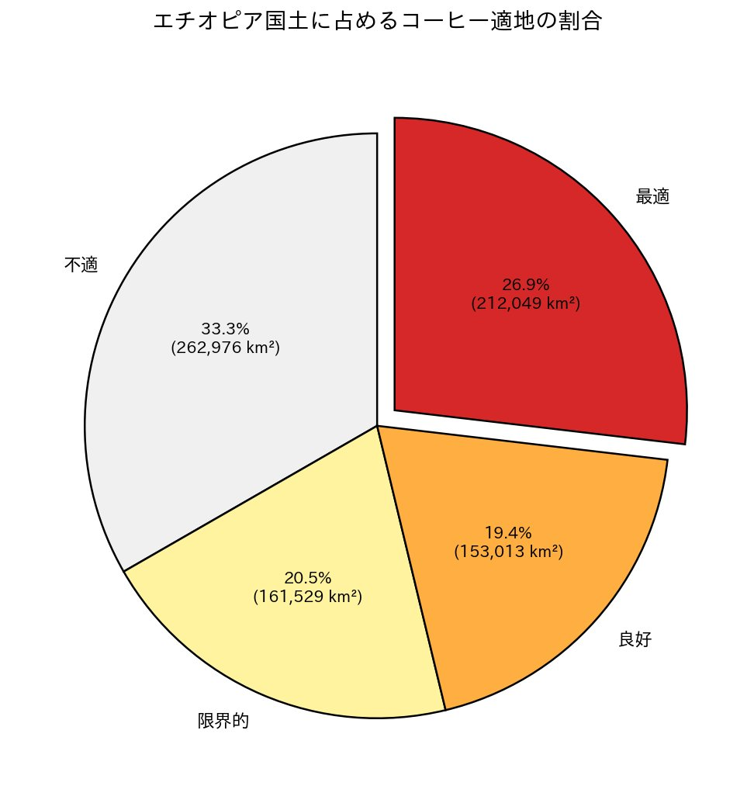
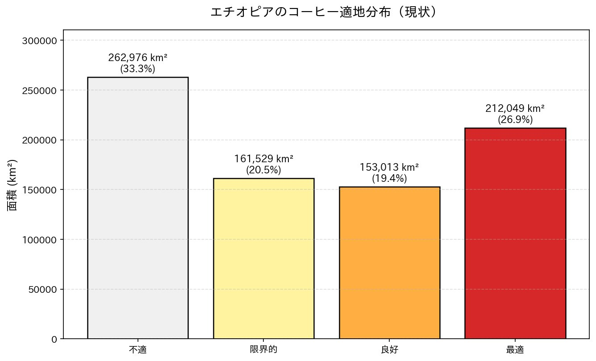

# ☕ エチオピアコーヒー適地マッピング
## ― 衛星データで「コーヒー2050年問題」に挑む ―

> **Frontier Academy Fukuoka 卒業制作（2026年6月）**  
> 作成者：森山 光明（Mitsuaki Moriyama）

---

## 🌍 このプロジェクトについて

地球規模の気候変動により、2050年までに**現在のアラビカコーヒー栽培地の約50%が栽培不適地になる**と予測されています（Bunn et al., 2015）。  
通称「**コーヒー2050年問題**」と呼ばれるこの課題に対し、本プロジェクトでは **衛星リモートセンシング × データ分析** の観点からアプローチします。

世界的なコーヒー産地であり、アラビカ種発祥の地でもあるエチオピアを対象に、複数の衛星データを統合して**現状の栽培適地を可視化**。既知の三大産地（Sidamo / Yirgacheffe / Harrar）との一致を検証することで、衛星データだけから「どこでコーヒーが育つか」を再現できることを示しました。

---

## 🎯 なぜこのテーマを選んだか

私は卒業前の18年間、スターバックスコーヒージャパンで店長として勤務してきました。エチオピア産のコーヒー豆も日々お客様に提供してきました。

しかし、**「あのカップに入っているコーヒーは、どこで、どんな環境で育っているのか」**を考えたことはあっても、自分の目で俯瞰したことはありませんでした。

職業訓練校でPythonとデータ分析を学ぶうちに、**衛星データを使えば現場では絶対に見られないスケールでコーヒーを「見る」ことができる**と気づき、このテーマに辿り着きました。

> コーヒーは、気候変動の影響を最も受けやすい作物のひとつ。  
> 18年間「価値を伝える」仕事をしてきた人間が、これからは「データで価値を可視化する」仕事ができないか。  
> その第一歩として、このプロジェクトを設計しました。

---

## 🛰️ 使用データ

すべて **Google Earth Engine（GEE）** から取得した、無料で公開されている衛星・気候データを使用しています。

| データ | プロダクト | 解像度 | 用途 |
|---|---|---|---|
| 標高 | SRTM (USGS) | 30m | DEM（数値標高モデル） |
| 気温 | ERA5-Land | 約11km | 年平均気温（2020-2024平均） |
| 降水量 | CHIRPS | 約5.5km | 年降水量（2020-2024平均） |
| 植生 | Sentinel-2 SR | 10m | NDVI（光合成活性指標） |
| 国境 | FAO GAUL 2015 | - | エチオピア国境ポリゴン |

---

## 🌱 アラビカコーヒーの適地条件

既存の農学研究（ICO、DaMatta et al., 2007、Bunn et al., 2015）から、アラビカ種の適地条件を以下の閾値モデルに落とし込みました。

| 要素 | 最適範囲（スコア1.0） | 許容範囲（スコア0.5） | 範囲外（スコア0.0） |
|---|---|---|---|
| 標高 | 1500〜2200m | 1200〜2500m | それ以外 |
| 年平均気温 | 18〜22℃ | 15〜24℃ | それ以外 |
| 年降水量 | 1200〜1800mm | 1000〜2000mm | それ以外 |
| NDVI | 0.4以上 | 0.3以上 | 0.3未満 |

これらを**重み付き合成**して総合適地スコアを算出：

```
適地スコア = 標高(0.30) + 気温(0.30) + 降水量(0.25) + NDVI(0.15)
```

標高と気温を重視したのは、コーヒーの**昼夜寒暖差・品質形成**において最も重要な要素だからです。

---

## 📊 結果

### 1. エチオピアのコーヒー適地マップ

濃い赤ほど適地スコアが高く（最適）、白いほど不適地を示します。



**主な観察：**
- 中西部〜南西部の高地（オロミア州・南部諸民族州）に濃い赤の領域が集中  
- 東部に独立した赤い帯（Harrar産地）  
- 北東部のダナキル砂漠・東部低地は不適地として正しく判定

### 2. 三大産地による妥当性検証

エチオピアを代表する三大コーヒー産地で、モデルの妥当性を検証しました。



| 地点 | 標高(m) | 気温(℃) | 降水量(mm) | NDVI | 適地スコア |
|---|---|---|---|---|---|
| Sidamo | 1,982 | 16.5 | 1,336 | 0.68 | **0.83** ✅ |
| Yirgacheffe | 1,957 | 16.9 | 1,666 | 0.72 | **0.85** ✅ |
| Harrar | 1,935 | 19.7 | 849 | 0.43 | **0.71** ✅ |
| Addis Ababa（首都） | 2,442 | 15.3 | 1,230 | 0.22 | 0.47 |
| Danakil（砂漠） | -119 | 33.4 | N/A | 0.04 | **0.00** ✅ |

**三大産地で0.71〜0.85の高スコア、首都・砂漠で低スコアという、現実と完全に一致する結果**が得られました。モデルが既知の適地分布を正しく再現できていることが定量的に示せました。

### 3. 三大産地の特性比較



レーダーチャートから興味深い発見が得られました：

- **SidamoとYirgacheffeのプロファイルがほぼ完全に重なる** — 両産地はどちらも南部高地に位置し、気候条件もほぼ同一。コーヒー業界で「シダモ系」とまとめて扱われる背景がデータからも見える。
- **Harrarだけが独自プロファイル** — 降水量0.0（849mm の乾燥地）にもかかわらず、気温1.0・標高1.0で総合スコア0.71を確保。「乾燥地で育つ独特のコーヒー」というHarrarの個性が定量化できた。

### 4. エチオピア国土の適地分布

 

| 区分 | 面積 (km²) | 割合 |
|---|---|---|
| 最適 | 212,049 | 26.9% |
| 良好 | 153,013 | 19.4% |
| 限界的 | 161,529 | 20.5% |
| 不適 | 262,976 | 33.3% |

**国土の46.3%（約36.5万km²）が「良好」以上のコーヒー適地**。日本の本州（約23万km²）を大きく上回る面積です。エチオピアが世界第5位のコーヒー生産国（年間約45万トン）である理由が、このマップで構造的に説明できます。

---

## 🔥 「コーヒー2050年問題」への接続

本プロジェクトでは**現状の適地マッピング**までを自力で実装しました。将来予測については、既存研究の結果を引用して考察します。

### 主要な既存研究

**Bunn et al. (2015)** *A bitter cup: climate change profile of global production of Arabica and Robusta coffee*  
→ 2050年までに、現在のアラビカ栽培地の **約50%が不適地化** すると予測。

**Moat et al. (2017)** *Resilience potential of the Ethiopian coffee sector under climate change*  
→ エチオピアでは、現在の栽培地の **39〜59%が2050年に不適地化** する一方、高標高地への産地シフトで**緩和可能**と指摘。

**Davis et al. (2019)** *High extinction risk for wild coffee species*  
→ 野生コーヒー種の **60%が絶滅危機**。エチオピアは野生アラビカの原産地であり、遺伝子資源保全の重要性。

### 本プロジェクトの位置づけ

本プロジェクトで作成した「現状の適地マップ」は、これら将来予測研究の**ベースライン**として機能します。  
今後、IPCCのSSPシナリオによる将来気温データを同じ閾値モデルに入力すれば、**簡易的な2050年予測マップ**も作成可能です。これは本プロジェクトの**次フェーズの課題**として位置付けます。

---

## 🌟 スターバックス18年の経験との接続

私はスターバックスで18年間、コーヒーと向き合ってきました。エチオピアのコーヒー豆を毎日扱い、お客様、時に従業員にも「この産地はね…」と語ってきました。

今回、衛星データから自分が抽出した適地マップを見たとき、**実際の生産地と寸分違わない領域が赤く光っている**ことに、ある種の感動を覚えました。

> 現場で18年積み上げた知識と、衛星データという科学的視点が、初めて「同じものを見ている」と実感した瞬間でした。

この経験から、コーヒー業界が直面している課題が**衛星データで本当に可視化・予測できる**ことを確信しました。

- **調達リスクの可視化** ― 産地ごとの気候ストレスを定量化し、5〜10年単位で調達戦略を立てる
- **農家支援** ― どの農地に投資すべきか、データで判断する
- **サプライチェーンの透明化** ― EUDR（EU森林破壊規制）などのコンプライアンス対応
- **品質予測** ― 標高×気温×昼夜寒暖差から、その年の品質を事前に推定

これらは18年現場にいた人間だからこそ「価値」が分かる仕事であり、それを衛星データという新しい武器で実現することが、これからの私のテーマです。

---

## 🛠️ 技術スタック

- **Python 3.11**
- **Google Earth Engine API** ― 衛星データ取得・処理
- **geemap** ― インタラクティブマップ可視化
- **pandas / numpy** ― データ処理
- **matplotlib / japanize-matplotlib** ― グラフ作成
- **Google Colab** ― 実行環境

---

## 📂 リポジトリ構成

```
ethiopia-coffee-suitability/
├── ethiopia_coffee_suitability.ipynb  ← メインNotebook
├── requirements.txt                    ← 必要ライブラリ
├── README.md                           ← このファイル
└── outputs/
    ├── suitability_map.png            ← 適地マップ
    ├── suitability_map_with_pins.png  ← 三大産地ピン付きマップ
    ├── suitability_distribution.png   ← 面積分布グラフ
    ├── suitability_pie.png            ← 割合円グラフ
    └── region_radar.png               ← 産地特性レーダーチャート
```

---

## 🚀 使い方

### 1. Google Cloud プロジェクトの準備
Google Earth Engineを使うには、Google Cloud プロジェクトとEarth Engineの登録が必要です。

### 2. ライブラリのインストール
```bash
pip install -r requirements.txt
```

### 3. Notebookの実行
`ethiopia_coffee_suitability.ipynb` を Google Colab または Jupyter で開き、冒頭の `project='your-gee-project-id'` を自分のプロジェクトIDに書き換えて実行。

---

## 🎓 学びと今後

### 本プロジェクトで達成したこと

1. ✅ 複数の衛星データ（標高・気温・降水・植生）を統合し、コーヒー適地スコアを算出
2. ✅ 三大産地での妥当性検証により、モデルの再現性を定量的に証明
3. ✅ 国土全体の適地分布を面積ベースで集計
4. ✅ 既存の気候変動研究と接続し、「2050年問題」の入口として位置付け

### 限界と今後の課題

- **閾値モデルの単純さ**：実際には土壌・斜面方位・霜害頻度なども影響するため、機械学習による精緻化が望ましい
- **NDVIは植生一般しか検出していない**：コーヒー樹そのものの分類には、教師データを使った分類モデルが必要
- **将来予測**：IPCCのSSPシナリオを統合した2050年予測マップが、次の挑戦

### 個人的な学び

職業訓練校に通い始めた2025年12月、私はPythonの「Hello, World!」から始めました。  
それから半年で、衛星データを使ってエチオピアのコーヒー産地を可視化できるようになりました。

**できないことが、できるようになっていく**――この感覚は、スターバックスで新人を育てていた時に何度も見てきたものです。改めて今自分自身が、それを体験しています。

これから先、データの力でコーヒー産業に、もっと広くは食料・農業の未来に貢献していきたい。  
このプロジェクトは、その旅の最初の一歩です。

---

## 📚 参考文献

1. Bunn, C., Läderach, P., Ovalle Rivera, O., & Kirschke, D. (2015). *A bitter cup: climate change profile of global production of Arabica and Robusta coffee.* **Climatic Change, 129**, 89–101.
2. Moat, J., Williams, J., Baena, S. et al. (2017). *Resilience potential of the Ethiopian coffee sector under climate change.* **Nature Plants, 3**, 17081.
3. Davis, A.P., Chadburn, H., Moat, J., O'Sullivan, R., Hargreaves, S., & Lughadha, E.N. (2019). *High extinction risk for wild coffee species and implications for coffee sector sustainability.* **Science Advances, 5**, eaav3473.
4. DaMatta, F.M., Ronchi, C.P., Maestri, M., & Barros, R.S. (2007). *Ecophysiology of coffee growth and production.* **Brazilian Journal of Plant Physiology, 19(4)**, 485–510.
5. ICO (International Coffee Organization) — 各種公開レポート

### データソース
- USGS SRTM: https://www2.jpl.nasa.gov/srtm/
- ECMWF ERA5-Land: https://www.ecmwf.int/en/era5-land
- CHIRPS: https://www.chc.ucsb.edu/data/chirps
- Copernicus Sentinel-2: https://scihub.copernicus.eu/

---

## 📬 Contact

森山 光明（Mitsuaki Moriyama）  
GitHub: [@Mitsuaki-1004](https://github.com/Mitsuaki-1004)

---

*このプロジェクトは Frontier Academy Fukuoka の卒業制作として、2026年6月に作成されました。*  
*コーヒーと、衛星と、18年の現場経験を一つのストーリーに紡ぐ試みです。*
